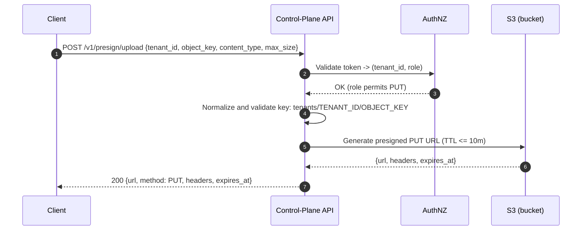
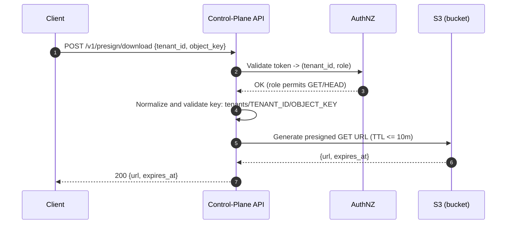
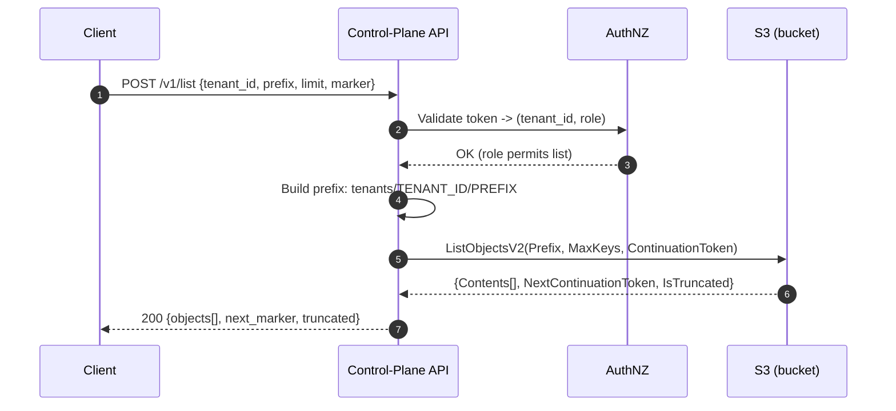
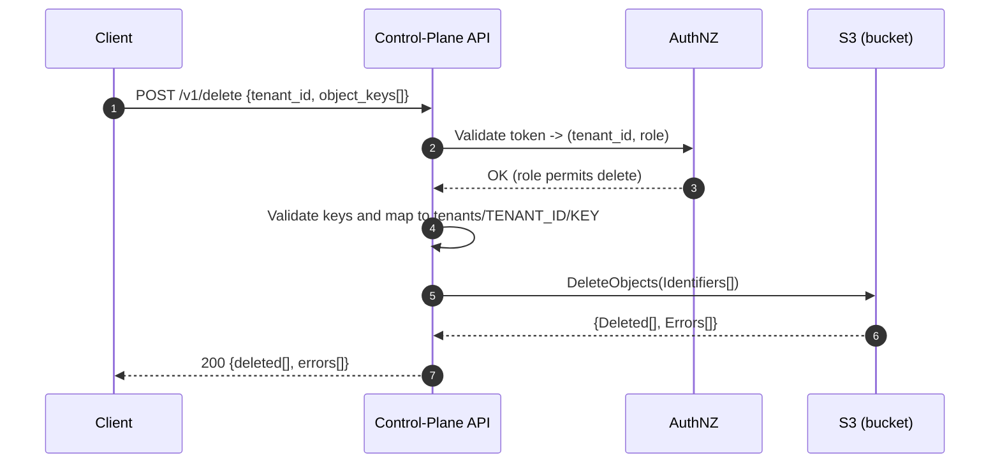

# Managed Object Storage API - MVP Mock

A simple Go-based API server that mocks a multi-tenant object storage control-plane. It returns realistic, stubbed S3-style presigned URLs and object listings without contacting AWS. Intended for design validation and a live demo.

## Quick Start (Runnable)
```bash
make build
make run            # starts on :8080
# In another terminal
make health         # quick ping
make curl           # exercise all endpoints
```

## API Endpoints
- GET `/healthz` – Health check
- POST `/v1/presign/upload` – Mock upload URL
- POST `/v1/presign/download` – Mock download URL
- POST `/v1/list` – Mock object listing
- POST `/v1/delete` – Mock delete

## Demo Scope
- This is a mock control-plane: no AWS calls, no auth. Responses are deterministic for demo/testing.
- Basic input validation and tenant-scoped key formatting mirror the ADR.

## Why this implementation
- Validate the ADR’s control-plane API quickly without cloud setup/creds.
- Demonstrate presigned-URL flow and tenant prefixing while keeping the control-plane out of the data path.
- Keep dependencies minimal for a reliable live demo.

## Considerations, decisions, assumptions
- Decision: Single bucket + tenant prefixes and presigned URLs (mocked) per ADR MVP.
- Assumption: AuthN/Z (tenant/role) is out-of-scope for the mock; would be enforced before presign in production.
- Consideration: Responses mimic S3 presigned query params and TTLs to ease client integration later.
- Non-goals (here): No AWS SDK/KMS/ACLs/RBAC; focused on API contract only.

## V2 improvements 
- Replace mocks with real S3 presign/list/delete
  - Challenge: IAM least-privilege, SSE-KMS, VPC endpoints, retries, error surfaces.
- Add AuthN/Z (tokens or OIDC → `reader|writer|admin`)
  - Challenge: tenant membership mapping, per-prefix enforcement, rate limits, audit trails.
- Multipart uploads + constraints (size, content-type, checksum)
  - Challenge: client compat, enforcing constraints at S3, validating from control-plane.
- Quotas and cost attribution per tenant
  - Challenge: metering (bytes/objects), inventory reconciliation, backfill/drift.
- Observability & operations
  - Challenge: metrics, alerting, CloudTrail data event costs, DR and incident response.

## Make Targets
- `make build` – Build the server
- `make run` – Start the server
- `make test` – Run tests
- `make health` – Quick health check
- `make curl` – Exercise all endpoints
- `make clean` – Remove build artifacts

## Note
This is a mock implementation for MVP demo purposes. It returns fake URLs/data and does not contact AWS.

## Workflows

- Presign Upload (source: docs/mermaid/presign_upload.mmd)


- Presign Download (source: docs/mermaid/presign_download.mmd)


- List Objects (source: docs/mermaid/list_objects.mmd)


- Delete Objects (source: docs/mermaid/delete_objects.mmd)

